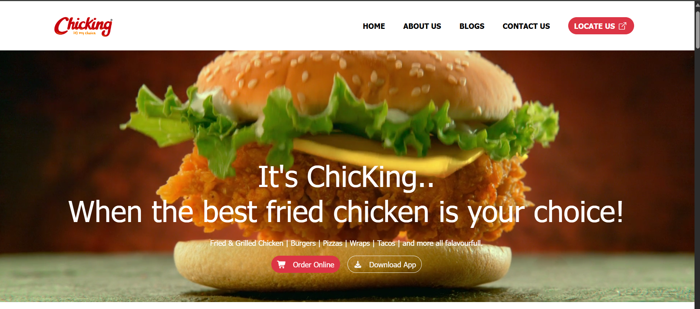
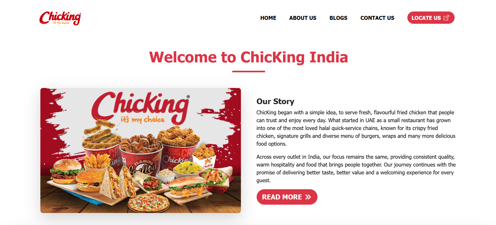
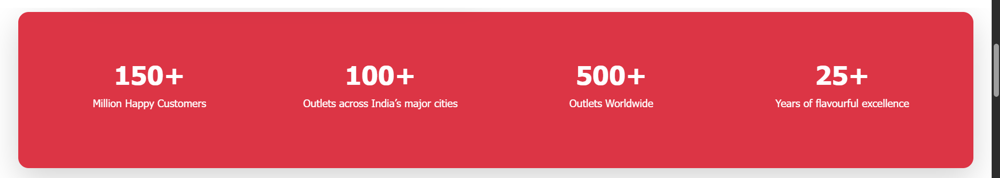
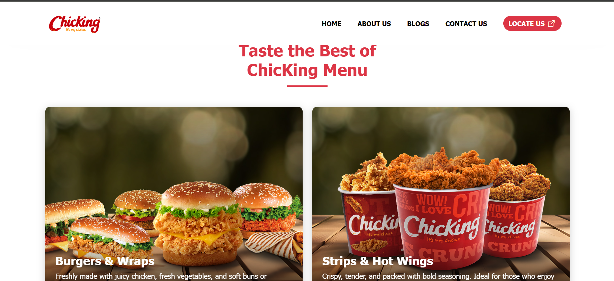

# 🍗 ChicKing India – Website Clone

A responsive, front-end clone of the **ChicKing India** fast-food restaurant website, built with **HTML5, CSS3 and Bootstrap 5**. This project was developed as part of my web development learning journey to practise building real-world, production-style landing pages.

> **Disclaimer:** This is an educational project created purely for learning and portfolio purposes. All brand names, logos, images and content belong to their respective owners. This project is not affiliated with, endorsed by, or connected to ChicKing in any way.

---

## 🔗 Live Demo

**Deployed Website:** 👉 https://chicking-website-clone.vercel.app/

**GitHub Repository:** https://github.com/MuhammedRizwan2385/chicking-website-clone/

---

## 📸 Preview

### Homepage


### Our Story


### Highlights


### Menu



---

## 📑 Table of Contents

- [About the Project](#-about-the-project)
- [Features](#-features)
- [Tech Stack](#-tech-stack)
- [Project Structure](#-project-structure)
- [Page Sections](#-page-sections)
- [Getting Started](#-getting-started)
- [Responsive Design](#-responsive-design)
- [Key Learnings](#-key-learnings)
- [Future Improvements](#-future-improvements)
- [Author](#-author)
- [License](#-license)

---

## 📖 About the Project

The goal of this project was to recreate the look and feel of the official ChicKing India website using core front-end technologies. It helped me strengthen my understanding of semantic HTML structure, the Bootstrap grid system, custom CSS styling, hover animations, and responsive layout design.

The website includes a full-screen video hero banner, an about section, statistics highlights, a visual menu showcase, an app download section, a store locator form, a blog section and a detailed footer.

---

## ✨ Features

- 🎥 **Full-screen hero banner** with autoplay, muted, looping background video
- 📌 **Sticky navigation bar** with smooth in-page anchor links
- 🍔 **Interactive menu cards** with image overlays, gradient text backgrounds and hover lift effects
- 📊 **Highlights section** displaying brand statistics in a responsive grid
- 📱 **App download section** with Android and iOS store buttons
- 📍 **Store locator UI** with State and District dropdowns
- 📰 **Latest news & blogs** cards with date badges and hover animations
- 🦶 **Detailed footer** with quick links, contact information and social media icons
- 🎨 **Consistent brand theme** using a red colour palette (`#a91917`)


---

## 🛠️ Tech Stack

| Technology | Purpose |
|------------|---------|
| **HTML5** | Page structure and semantic markup |
| **CSS3** | Custom styling, animations, transitions, media queries |
| **Bootstrap 5.3.8** | Responsive grid, components and utility classes |
| **Bootstrap Icons 1.13.1** | Icon set for UI elements |
| **Font Awesome 7.3.1** | Additional icons (cart, download, social media) |
| **Google Font – Poppins** | Typography (with fallback fonts) |

All libraries are loaded through CDN links, so no installation or build step is required.

---

## 📂 Project Structure

```
chicking-clone/
│
├── images/              # Logos, menu images, blog images, app badges
├── videos/              # Hero banner video (hero-video.mp4)
├── index.html           # Main HTML file
├── styles.css           # Custom CSS styles
└── README.md            # Project documentation
```

---

## 🧩 Page Sections

1. **Header / Navbar** – Logo, navigation links and a "Locate Us" call-to-action button
2. **Hero Banner** – Background video with headline, tagline, and *Order Online* / *Download App* buttons
3. **Our Story** – Brand introduction with image and *Read More* button
4. **Highlights** – Key brand statistics (customers, outlets, years of excellence)
5. **Menu** – Categorised food cards: Burgers & Wraps, Strips & Hot Wings, Fried & Grilled Chicken, Pizzas & Tacos, Sides & Beverages
6. **Download Our App** – Android and iOS download buttons
7. **Store Locator** – State and District selection form
8. **Latest News & Blogs** – Three blog cards with date badges
9. **Footer** – About text, quick links, contact details and social icons

---

## 🚀 Getting Started

### Prerequisites

- A modern web browser (Chrome, Firefox, Edge, Safari)
- An internet connection (required to load Bootstrap, Font Awesome and Google Fonts from CDN)
- *(Optional)* [VS Code](https://code.visualstudio.com/) with the **Live Server** extension

### Installation & Running Locally

1. **Clone the repository**
   ```bash
   git clone YOUR_GITHUB_REPO_LINK_HERE.git
   ```

2. **Navigate to the project folder**
   ```bash
   cd chicking-clone
   ```

3. **Open the project**
   - Double-click `index.html` to open it in your browser, **or**
   - Right-click `index.html` in VS Code and choose **Open with Live Server**

---

## 📱 Responsive Design

The layout adapts to different screen sizes using Bootstrap's grid system together with custom CSS media queries:

| Device | Breakpoint | Behaviour |
|--------|-----------|-----------|
| Desktop | ≥ 992px | Multi-column layouts, large headings |
| Tablet | ≤ 992px | Reduced heading sizes, adjusted columns |
| Mobile | ≤ 768px | Smaller hero text, stacked sections |

---

## 🎓 Key Learnings

- Structuring a complete multi-section website from scratch
- Using the **Bootstrap 5 grid** (`container`, `row`, `col-*`) and utility classes effectively
- Implementing a **background video** using `position`, `z-index` and `object-fit`
- Creating **overlay cards** with CSS gradients and absolute positioning
- Adding **hover effects** with `transform`, `transition` and `scale`
- Making layouts responsive with **media queries**
- Integrating icon libraries through CDN
- Organising project files and assets professionally
- Deploying a static website and sharing it via GitHub

---

## 🔮 Future Improvements

- [ ] Add JavaScript to dynamically populate the **District** dropdown based on the selected State
- [ ] Build a working store locator with outlet addresses and map integration
- [ ] Add a functional **Contact Us** page
- [ ] Add a mobile hamburger menu for smaller screens
- [ ] Link the Android / iOS download buttons to real store URLs
- [ ] Create dedicated pages for Menu, Blogs and About Us
- [ ] Add scroll-reveal animations
- [ ] Improve accessibility (alt text, ARIA labels) and SEO
- [ ] Optimise images and video for faster loading

---

## 👤 Author

**M Muhammed Rizwan**

- GitHub: @MuhammedRizwan2385
- LinkedIn: www.linkedin.com/in/m-muhammed-rizwan

---

## 📄 License

This project is intended for **educational and portfolio purposes only**. It is not meant for commercial use. All trademarks, logos and brand assets belong to their respective owners.

---

## 🙏 Acknowledgements

- [ChicKing India](https://chickingindia.in/) – Original design inspiration
- [Bootstrap](https://getbootstrap.com/) – Front-end framework
- [Bootstrap Icons](https://icons.getbootstrap.com/) and [Font Awesome](https://fontawesome.com/) – Icon libraries
- [Google Fonts](https://fonts.google.com/) – Poppins typeface

---

⭐ *If you found this project helpful or interesting, consider giving it a star on GitHub!*
